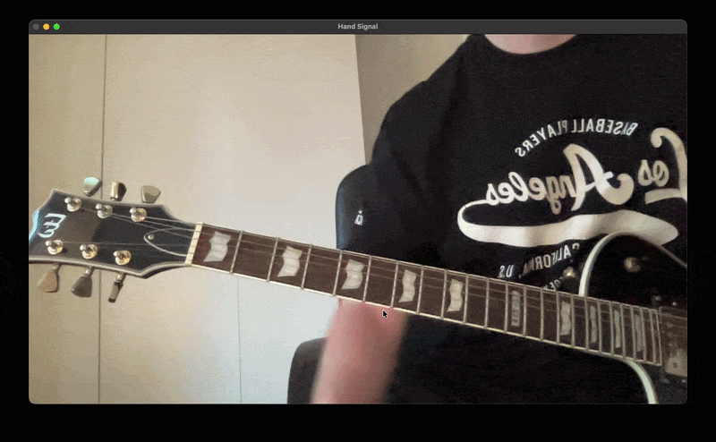

# SPIS

🎸 Overview
A real-time system that detects guitar chords from hand movements using signal processing and machine learning.

⚙️ How it works
Camera captures Webcam video and MediaPipe extracts finger joint/hand positions

Fingertip coordinates are extracted from the detected hand position

Pairwise distances between fingertips are computed to describe hand geometry

A median filter is applied to reduce jitter while keeping low latency

A sliding window stores recent frames to capture motion over time

Windowed data is converted into features using mean and standard deviation, then scaled and passed into a trained SVM model

Final predictions are stabilized using a short voting buffer to reduce flickering outputs

🧠 Tech Stack
Python • OpenCV • MediaPipe • NumPy • Scikit-learn
